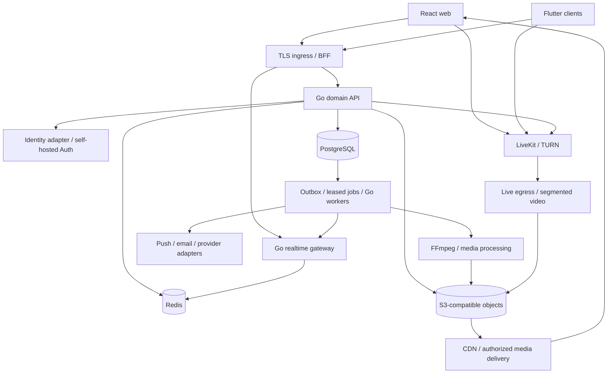

# Alsamos backend: repository audit and implementation blueprint

Audit date: 2026-09-08. Target: **SamandarAlimov/socialalsamos**.
Baseline: `main` at `de7fd2099781f873227a805af3d4604d10a79306`.
Status: architecture and implementation specification; backend implementation and production cutover are not completed by this document.

## 1. Purpose and boundaries

Build an independently operated backend completely in isolation, prove feature parity, then connect the existing clients in controlled stages. Production stays on Supabase while that work is underway. This change adds documentation only: no application dependency, database, environment, endpoint, storage policy or deployment is changed.

The audited repository is React 18 / TypeScript / Vite, not Flutter. The separate Flutter repository shares data contracts and must eventually pass compatibility testing, but is not the source of this audit. The working checkout for this audit is `D:/Alsamos/socialalsamos-backend-audit`; its origin is the exact requested repository.

“100% complete” means every inventoried contract has an implementation, authorization tests, operational owner and migration evidence. No architecture can guarantee elimination of every future defect. Unknown production facts are explicitly marked below; they are release blockers where relevant, not assumptions disguised as findings.

### Evidence scope

- Read repository configuration, existing architecture/contracts, sensitive auth/cron code, RTC/live implementations, media proxy, wallet handler and representative schema/client paths.
- Enumerated all Edge Function directories, migration filenames and static client table/RPC references; the appendix records coverage, not a claim that every SQL policy was dynamically verified.
- Baseline contains 177 migration files and 174 source files matching `integrations/supabase|supabaseAny` imports/references. Counts are scan results at this commit, not live database counts.
- No production database credentials, billing exports, object listing, server access, traffic measurements or deployed environment values were inspected. No attack requests were made against production.
- `infra/STATUS.md` describes earlier infrastructure outside this repository. Its deployed/DONE claims are historical documentation, not independently verified server state.
- A tracked `.env` exists. Its values were deliberately not printed. Inventory key classes privately before deciding whether any credential needs rotation; a public Supabase publishable key alone is not a leaked secret.

## 2. Audit findings and required closure

Severity describes impact if the observed path is deployed/reached. “Conditional” means production configuration is unknown.

| ID | Priority / evidence | Finding and impact | Required solution and acceptance evidence |
|---|---|---|---|
| A01 | P0 conditional; `supabase/functions/_shared/guard.ts:26`, `:244`; `ai-assistant/index.ts:89` | Default `AUTH_ENFORCE` is `log`; unauthenticated guard returns `response: null`. Paid work may proceed unless deployment explicitly enforces auth. | New backend must fail closed with no configurable auth bypass in production. Missing token, invalid signature, wrong audience, expired token and unavailable verifier must never start paid work. Verify deployed current mode separately. |
| A02 | P0 conditional; `supabase/functions/send-scheduled-messages/index.ts:43` | Invalid cron secret blocks only in `on` mode. Otherwise privileged scheduled processing continues. | Dedicated worker identity; no public trigger without valid job credential. Missing/wrong secret tests must produce no DB mutation. Rotate independently from service-role credentials. |
| A03 | P1; `_shared/guard.ts:282` | Rate limiting counts usage rows before work; concurrent requests can observe the same count. Database errors are not a reliable admission decision. | Atomic admission counter, per-user and per-IP limits plus durable budget reservation for paid operations; concurrency tests cannot exceed reserved spend. |
| A04 | P1; `src/hooks/useLiveStreamWebRTC.ts:22-55` | Broadcaster creates a peer connection and publishes tracks per viewer. Uplink/CPU grow with viewers. At the configured 1.5 Mbps cap, 100 viewers imply roughly 150 Mbps publisher video uplink before overhead. | Publish to an SFU; large passive audience uses segmented playback/CDN. Verify broadcaster uplink is bounded as viewers grow. |
| A05 | P1; `supabase/functions/webrtc-signaling/index.ts:32`; `live-stream-signaling/index.ts:19` | Relay rooms/viewers are process-local Maps. Two instances or restart do not share state. Calls have a documented DB fallback, so this is a scaling/reliability limitation rather than proof all calls fail. | Dedicated realtime process, distributed routing/presence and durable call state. Two-node relay/restart tests; call recovery never depends on one process Map. |
| A06 | P1; `live-stream-signaling/index.ts:26-49` | Viewer access checks live status, while broadcaster checks ownership. This function does not establish block/private-audience authorization. | Explicit stream visibility and block/moderation checks before issuing viewer credentials. Test stranger, blocked user, removed participant and ended stream. Product visibility policy must be explicit. |
| A07 | P1; both signaling functions, `queryToken` handling | Long-lived bearer tokens accepted in URLs; URL logging can expose sessions. No production log leak was verified. | Single-use short-lived WS ticket, origin checks, redacted access logs and authentication timeout. Close on expiry/revocation and limit message bytes/connections. |
| A08 | P1; `src/integrations/supabase/sharedCookieStorage.ts:31-39` | Browser JS writes session cookies across `.alsamos.com`; these cannot be HttpOnly. A compromised sibling app increases session exposure. | Central OIDC login with per-app host-only HttpOnly session cookies through BFF; preserve linked-account slots. Add CSRF/origin protection and SSO logout tests. |
| A09 | P1 migration blocker; `docs/CONTRACTS/db-schema.md` | Two non-superset migration streams target one DB; contract documents duplicate timestamps and earlier damage. | Export actual schema/roles/extensions/functions/policies and migration history; reconcile both streams into an immutable baseline manifest. Never blindly replay only this repo. |
| A10 | P1 migration blocker; `api/media-presign.ts`, `docs/LEGACY_MEDIA_INCIDENT_20260906.md` | Storage is already hybrid. Existing incident records broken legacy/public URLs and warns against deleting metadata on fetch failure. | Copy bytes plus metadata, checksum manifests, privacy parity and a legacy URL resolver. 403/404 must not delete references. Test cached and fresh origin reads. |
| A11 | P1; `wallet-payme-merchant/index.ts:80-93` | Same handler accepts live key and optional test key against its configured backend. If both are configured in production, test credentials share that environment. | Separate provider sandbox/live endpoints, credentials and ledgers; production rejects sandbox credential. Inspect actual deployment before asserting exposure. |
| A12 | P1 migration blocker; `src/lib/messagePipeline.ts`, `docs/CONTRACTS/message-protocol.md` | Messages use relational aliases, optional fields, client IDs and legacy JSON/string payload tolerance across two clients. URL replacement alone cannot preserve these contracts. | Fixtures for every payload type and old row shape; preserve IDs, author identity, ordering, deletion and retry semantics. |
| A13 | P2; `src/integrations/supabase/client.ts`; static import scan | Direct SDK access is spread through UI/hooks. Supabase is a protocol dependency, not merely one connection string. | Domain adapters and versioned API contracts; ban new direct SDK imports in migrated domains. No broad rewrite during this documentation step. |

Current `verify_jwt=false` is not itself a vulnerability: OAuth, provider webhooks and manual authentication legitimately need it. Audit every reachable handler and action, including privileged RPCs, not just its config flag. Findings above are not an exhaustive penetration-test report.

## 3. Language and technology decisions

Start with a **Go modular monolith**, separate worker and realtime processes, PostgreSQL, Redis and S3-compatible object storage. Separate processes are justified by connection lifetime/CPU profiles; domain modules do not each need their own network service or database. Extract services only after measured isolation/scaling needs.

| Component | Language / implementation | Responsibility and reason |
|---|---|---|
| Existing web | TypeScript / React | Keep current UI and later introduce typed domain adapters. |
| Existing mobile/desktop | Dart / Flutter, separate repository | Same OpenAPI/event/message contracts; no change here now. |
| Core API and BFF | Go, standard HTTP routing, pgx, generated sqlc queries | Identity integration, authorization, transactions, business rules; bounded concurrency and explicit SQL. |
| Realtime gateway | Go / WebSocket | Authenticated subscriptions, delivery acknowledgements, replay, presence; no video bytes. |
| Jobs/scheduler | Go workers + PostgreSQL job/outbox tables | Notifications, scheduled content, exports, media orchestration, retries and reconciliation. |
| Calls and interactive live | Self-hosted LiveKit SFU (upstream Go implementation) | Reuse maintained WebRTC transport; Alsamos Go code owns room permissions and lifecycle. Do not implement codecs/SFU from scratch. |
| NAT traversal | LiveKit embedded TURN; coturn only if separate relay requirements justify it | UDP and TURN/TLS fallback with expiring credentials; do not introduce two relay systems by default. |
| Video/audio processing | FFmpeg executable, orchestrated by Go | Transcode, thumbnails, waveform, HLS variants; isolated CPU workers. No custom C/C++ codec code. |
| Identity | Initially Supabase verifier; final self-hosted maintained Supabase Auth behind identity adapter | Preserve identity semantics while removing managed hosting. Separate control of sessions, account slots, MFA and OIDC facade. A future different IdP requires its own tested migration. |
| Relational/geographic data | PostgreSQL / SQL; PostGIS where required | Durable source of truth, constraints, transactions and geo indexes. |
| Cache/presence | Redis | Expiring presence, atomic rate limits and disposable cache; never sole wallet/message storage. Verify exact Redis-compatible version against LiveKit. |
| Objects | S3-compatible storage, initially preserve existing provider behind adapter | Media bytes and export archives; provider-neutral keys and checksums. Audit existing MinIO operational/license posture before choosing its deployment version. |
| AI integration | Go provider adapters initially | Budgeting, streaming, provider isolation. Python workers only when actual model inference/ML libraries require them. |
| Search | PostgreSQL FTS/trigram initially | Avoid a new cluster until measured query/index load warrants OpenSearch or another evaluated engine. |
| Analytics | Aggregated PostgreSQL initially; ClickHouse when justified | Keep high-volume impressions off transactional hot rows; asynchronous derived data. |
| Infrastructure | Containerfiles, YAML, SQL, shell/PowerShell | Reproducible local/staging environments and CI; no new language solely for deployment. |

These are design choices, not installed dependencies. Pin supported toolchain versions and image digests at implementation after compatibility/security checks. TypeScript remains appropriate for current Edge Functions during parity development; port behavior deliberately, not line-by-line syntax.

Self-hosted Supabase is a possible lower-change transitional deployment, but merely moving the whole stack does not solve RTC fanout, query amplification or operational costs. The selected destination removes direct client DB access gradually while retaining maintained Auth rather than inventing password security.

## 4. Runtime architecture



Only ingress, media delivery and required RTC ports are public. PostgreSQL, Redis, administrative APIs and metrics stay private. Use separate credentials per process and environment. Object upload travels directly to storage through short-lived scoped permissions; API validates completion before publishing assets.

## 5. Proposed backend directory structure

Everything below is **planned**, not a claim these files exist. Keep current `src/`, `api/`, `supabase/`, `workers/` working until their replacement passes parity.

```text
backend/
  README.md
  go.mod / go.sum
  cmd/{api,realtime,worker,migrate}/main.go
  internal/
    platform/{config,http,db,auth,observability,clock,idempotency}/
    domains/
      identity/ profiles/ relationships/ privacy/
      content/ feeds/ stories/ comments/ reactions/
      messaging/ channels/ calls/ live/
      media/ notifications/ search/ maps/
      marketplace/ logistics/ wallet/ payments/
      miniapps/ bots/ oauth/ ai/ ads/
      moderation/ admin/ feedback/ exports/ settings/
    adapters/{supabase,objectstore,push,email,payme,livekit,ai}/
    jobs/{outbox,scheduler,reconciliation,retention}/
  contracts/
    openapi.yaml
    events/ schemas/ fixtures/
    parity.csv
    database-manifest.json
  db/{baseline,migrations,queries,seeds}/
  tests/{unit,integration,contract,security,load,migration}/
  deploy/{compose,staging,production}/
  observability/{dashboards,alerts}/
  runbooks/{restore,cutover,rollback,incident,key-rotation}/
  scripts/{inventory,copy-objects,reconcile,verify}/
```

Each domain contains transport handlers, service rules, repository SQL and tests. HTTP handlers do not make ad hoc writes into another domain's tables. Cross-domain transactions remain local Go service calls in the monolith; external side effects go through an outbox.

## 6. Domain ownership and non-negotiable invariants

The following covers observed product surfaces. Table names are existing examples; full static names are in the appendix. New internal schema names must not rename public contracts during migration.

| Domain | Existing evidence | Replacement obligations |
|---|---|---|
| Identity/accounts | `account-*`, `sso-session`, `src/integrations/supabase/` | Login, recovery, verification, MFA, linked accounts, devices, session revoke, suspension, account deletion and SSO. Stable user UUIDs and identity/account relationships. |
| OAuth/developer | `oauth-*`, `openid-configuration`, `github-connector` | PKCE, exact redirect allowlist, consent, scopes, client registration, hashed secrets, code single use, revocation and connector credentials encrypted at rest. Public clients never hold secrets. |
| Profile/privacy | profiles, relationship/settings hooks | Follow/block/mute, reservations, discoverability, privacy, profile edits; authorization derived from server state, never editable profile flags. |
| Posts/feed/stories/video | `usePosts`, `usePostMedia`, compose and insights | Draft/publish/schedule/archive, collaborations, media order, comments, polls, reactions, visibility and counters. Server time determines expiry. |
| Messaging/channels | `useMessages`, message protocol, scheduled jobs | DMs, requests, groups/channels, membership/roles, edits, delete-for-me/everyone, read cursors, mentions, pins, forwards, stickers, voice/video/location and per-account drafts. |
| Calls/live | RTC hooks and signaling functions | Call state, invitations, accept/reject/busy, multi-device races, reconnect, history, audience rules and moderation. |
| Media | `api/media-*`, proxy, legacy incident | Upload/finalize, ownership, processing, downloads/ranges, signed access, orphan cleanup and legacy URL compatibility. |
| Wallet/payments | `useWallet`, Payme functions, settlement SQL | Transfers, topups, merchant callbacks, receipts, immutable ledger and reconciliation. Clients never set balances. |
| Marketplace/logistics | `useOrders`, latest logistics/checkout migrations | Catalog, seller access, stock reservations, quote expiry, order transitions, reviews/media, shipment legs/events, customs metadata and delivery location privacy. |
| Maps | map APIs, transit function, location hooks | Bounding-box/geo queries, routing/provider adapters, caching, live-location consent/expiry, stale data labels and quota limits. |
| Miniapps/bots | `src/features/miniapps`, mini-app/bot functions | Manifest/version, domain verification, sandboxed embedding, init-data signatures, grants, rate limits, payments and developer revocation. |
| AI/sandbox | AI functions, `sandbox/` | User scope, budgets, cancellation, timeouts, provider callbacks, tool authorization and isolated execution without internal network credentials. |
| Ads/analytics | ads pages and migrations | Campaign budgets, moderation, delivery/pacing, frequency caps, experiment assignment and fraud-resistant event dedupe. |
| Admin/moderation | control/moderation pages/functions | Role-scoped admin, immutable audit, reports/cases/appeals, bans and removal propagated to feeds/search/media/realtime. |
| Notifications/activity | notification/activity pages, scheduled work | In-app and provider delivery, preferences, mute/quiet hours, dedupe, unread counts, account isolation. |
| Search/feedback/export/settings | search functions, feedback/settings pages | Permission-aware search, retention, user export/deletion, feedback threads and synchronized preferences. |

No inferred surface is marked production-ready simply because a page or table exists. `parity.csv` must track each action separately, including failure and offline cases.

## 7. API and event contracts

- REST prefix `/v1`; OpenAPI is authoritative. Generate TS/Dart clients later without requiring a UI rewrite.
- Requests carry a request ID and supported contract version. Trace IDs may be generated server-side; never trust them as identity.
- Standard error body: `{"error":{"code":"FORBIDDEN","message":"Access denied","request_id":"...","retryable":false}}`. Do not expose SQL, credentials or internal URLs.
- Standard collection: `items`, opaque `next_cursor`, `has_more`; default 30, maximum 100. Cursor binds sort/filter and stable `(created_at,id)` or domain sequence; do not use unbounded offset for hot feeds.
- Validate sizes, enums, UTF-8, URLs and metadata nesting. IDs must be syntactically valid and authorized; knowing an ID is not permission.
- Mutating retries use `Idempotency-Key`, scoped to principal and operation, storing request hash and committed response. Same key/different body returns conflict. Wallet dedupe records persist with financial records; routine operations use documented retention.
- Optimistic edits carry `expected_version`; conflicting version returns 409 and current safe state. Do not let stale clients overwrite new permissions.
- Preserve `alsamos.message.v1`, snake_case legacy wire fields and legacy JSON/string parsing at adapter boundaries.

| Endpoint family (planned) | Core contract |
|---|---|
| `/v1/session`, `/v1/accounts`, `/v1/devices` | Identity/account separation, slot switch and revocation |
| `/v1/profiles`, `/v1/relationships`, `/v1/settings` | Actor-bound writes and privacy-aware reads |
| `/v1/feed`, `/v1/posts`, `/v1/stories`, `/v1/comments` | Stable paging, audience checks, idempotent reactions |
| `/v1/conversations/{id}/messages` | Membership, client_message_id, canonical message response |
| `/v1/sync`, `/v1/ws-ticket` | Scoped replay cursor and single-use connection credential |
| `/v1/calls`, `/v1/calls/{id}/join-token` | State machine and room-bound least-privilege token |
| `/v1/live`, `/v1/live/{id}/playback` | Audience authorization and expiry |
| `/v1/media/uploads`, `/v1/media/{id}/complete` | Reserved bytes, ownership and finalized asset |
| `/v1/products`, `/v1/orders`, `/v1/shipments` | Price/stock server authority, allowed transitions |
| `/v1/wallet/transfers`, `/v1/payments/intents` | Atomic ledger and provider idempotency |
| `/v1/search`, `/v1/maps`, `/v1/notifications` | Permission filters, limits and per-user state |
| `/v1/miniapps`, `/v1/bots`, `/v1/ai/jobs` | Grant- and quota-bound execution |
| `/v1/admin`, `/v1/exports`, `/v1/feedback` | Auditable role/ownership checks |

Event envelope: `event_id`, `type`, `schema_version`, `aggregate_id`, `aggregate_version`, `occurred_at`, and a minimal `payload`. Recipient identity is server-derived. Examples: `message.created.v1`, `message.deleted.v1`, `call.updated.v1`, `media.ready.v1`, `order.updated.v1`, `session.revoked.v1`.

Use at-least-once delivery with durable consumer dedupe. Do not promise exactly-once network delivery. PostgreSQL transaction writes both state and outbox event; a worker publishes after commit. Consumers persist event IDs/versions before acknowledging. Publish failure retries without losing committed state.

## 8. Database and authorization design

1. Preserve existing primary keys, foreign keys, enum meanings, time zones, null semantics and public message shapes in baseline import.
2. Inventory `auth`, `storage`, `public`, extensions, triggers, cron jobs, grants, views and security-definer functions. Supabase-specific `auth.uid()` references need an explicit compatibility implementation or rewrite; plain PostgreSQL does not provide them automatically.
3. API database role is not superuser, table owner or BYPASSRLS. Use transaction-local verified actor context and audit all paths that can set it. Reset pool state by transaction boundaries; test cross-request identity leakage.
4. Keep RLS defense in depth where practical. Application authorization also covers object access, nested joins, search, counts and events. Background maintenance has separate narrowly scoped roles.
5. For each table, record owner, visibility predicate, allowed verbs, unique keys, deletion policy and export inclusion. For every privileged function, test anonymous, ordinary user, stranger and admin; review `search_path`, grants and dynamic SQL.
6. Financial values use integer minor units plus currency; large integers cross JSON as decimal strings. Never floating-point balances.
7. Critical unique keys include message client ID scoped to conversation/sender, provider transaction ID scoped to provider/environment, reaction actor/object, and event consumer/event ID.
8. Messaging indexes start with `(conversation_id, sequence)` and membership `(user_id,conversation_id)`; feed indexes match visibility and cursor predicates. Determine final indexes with EXPLAIN on representative data; avoid indexing every column.
9. Partition append-only analytics/history only when measured size/retention needs it. No early user sharding or cross-region active-active wallet writes.
10. New Supabase-side migration scripts remain additive/idempotent, with guarded policies/publications and final `NOTIFY pgrst, 'reload schema';`. User applies source SQL manually. Target migrations are versioned with checksums and staged expand/backfill/validate/contract steps.

## 9. Messaging, realtime and offline correctness

Allocate per-conversation message sequence under transaction serialization. Commit message, conversation summary and outbox together. An API success means durable commit. The same client message ID retries to the same record. A delivery acknowledgment is distinct from a read receipt.

WebSocket connection has an authenticated principal, device/account slot, heartbeat, bounded send buffer and subscription limits. Check membership on subscribe and on protected fanout; removal/revocation terminates relevant subscriptions promptly. Redis Pub/Sub is only a wake-up mechanism: durable replay comes from the database/event log.

Reconnect requests events after an acknowledged cursor. Cursors are scoped to the account and stream. A retention gap returns `resync_required`, leading to a consistent snapshot with a watermark and buffered subsequent events. Avoid the subscribe/snapshot race. Slow consumers disconnect cleanly and replay rather than exhausting server memory.

Presence/typing expire in Redis and may be lost safely. Never broadcast precise last-seen against privacy settings. Online status is not proof of message read.

Offline queue stores account ID, client operation ID, dependencies and retry state. React needs an IndexedDB-backed adapter where offline writes are required; Flutter retains its local SQLite implementation. Switching accounts must not send another account's queued message. Upload-before-send is an explicit dependency. Retry transient errors with jitter; reject forbidden/deleted conversations permanently with visible state.

Tombstones synchronize deletions. Message edits use version checks; read cursors only advance. Server time governs expiry, schedules and authorization. Test duplicate, delayed and out-of-order events, clock skew, 24-hour offline devices and missing legacy metadata.

## 10. Calls and live streaming

### Calls

Alsamos Go API owns a versioned lifecycle: `created -> ringing -> accepted -> connecting -> active -> ended`, with terminal `rejected`, `busy`, `cancelled`, `missed`, `failed`. Persist reason codes and timestamps. Map existing client statuses explicitly in contract fixtures; do not rename live SQL statuses in this step.

Create/accept/end use conditional updates, idempotency and a timeout worker. Two callee devices racing to accept produce one winner. Late accept cannot resurrect a cancelled call. Define active-call uniqueness by conversation and participant using transaction locks/constraints. Check blocks, membership and account status at invitation and token issuance.

Go issues short-lived room- and identity-bound LiveKit tokens with publish/subscribe permissions; clients cannot choose privileged room grants. Handle signed, duplicate and out-of-order room webhooks. Token expiry alone does not terminate an already-connected participant: explicitly remove participants/end rooms on revocation and prevent token reissue. Self-hosted token revocation capabilities differ from cloud; verify against the pinned server version.

Deploy public-IP-aware SFU nodes, trusted TLS and tested UDP/TCP/TURN paths. TURN/TLS on 443 needs a suitable dedicated IP or layer-4 routing; it cannot simply share a normal HTTP route. Configure firewall ports from the exact deployment version. Keep SFU bandwidth/CPU separate from API workers.

Test Android/web/Windows browsers and Flutter clients, microphone/camera denial, audio-only fallback, device switching, headset, screen share, tab suspend, network handover, symmetric NAT, UDP blocked, TURN-only, packet loss and node termination. Notifications wake/inform a client but do not change call state authoritatively.

### Live broadcast

Publisher/co-hosts publish to LiveKit. Interactive participants use WebRTC. Large passive audiences consume HLS/low-latency segmented output via CDN after access policy validation. Self-hosted LiveKit rooms remain bounded by an individual room's node capacity; adding nodes does not make one room infinitely scalable.

Live egress/transcoding is a separate worker pool, not part of request handlers. Provide adaptive variants, audio-only option, segment cleanup, poster, replay recording policy and an explicit failure state. Recording requires product consent/retention rules; it is not automatically enabled for private calls.

Persist stream state, host/moderators, audience, moderation actions and recording assets. Approximate presence counts must not be billing truth. Viewer chat uses ordinary messaging/rate limits. Bans invalidate playback/token access with a documented maximum TTL and cache purge behavior.

Transport encryption is not automatically end-to-end encryption. Do not advertise E2EE until client key distribution, recovery and threat model are implemented. Server-side recording/moderation/transcription of encrypted media requires an explicit compatible design.

## 11. Media lifecycle

`reserved -> uploading -> uploaded -> scanning -> processing -> ready`, or `failed/quarantined/deleted`.

Upload reservation binds actor, purpose, content limits and object key. Use resumable/multipart upload, checksum verification, MIME sniffing and file-size limits. Finalization verifies object ownership and actual bytes before enqueueing work. Signed uploads alone do not prove safe media.

Run FFmpeg and document/image processing in unprivileged resource-limited containers with timeouts and restricted network. Protect against decompression bombs, malicious codecs and oversized dimensions. Never interpolate user filenames into shell commands.

Store asset IDs, bucket/key, provider, checksum, byte size, MIME, dimensions, duration, variants and access policy. Store stable identifiers, not expiring signed URLs as canonical data. Support range requests and content disposition. Private media must not enter a shared public cache; a privacy change revokes delivery and purges cached variants according to policy.

Migration manifest maps every old reference to source object and verified target object. Preserve multi-image ordering and legacy message attachment formats. Separate “unavailable now” from “confirmed absent”; quarantine discrepancies for repair. Garbage collection requires references checked across posts, messages, stories, reviews and exports plus a grace period.

## 12. Wallet, orders, providers and jobs

Wallet is an immutable balanced ledger: every transfer has balanced entries for one currency. Lock affected accounts in deterministic order; validate available balance and limits; post entries and outbox atomically. Reversal is another transaction, never editing old money history. Cached balance is reconciled against ledger totals.

Payment intents and callbacks bind merchant, environment, currency, amount and order/account. Validate the provider's actual authentication/signature protocol and replay rules. Dedupe create/perform/cancel independently where the provider supports them. Client success screens never credit funds. Daily reconciliation compares provider records with intents, ledger and settlements; unmatched rows enter a review queue.

Order checkout reserves inventory and server-calculated prices/shipping quotes in a transaction. Reservation expiry returns stock exactly once. An order transition requires role and expected current state. Payment failure, timeout, refund, partial fulfillment and shipment updates have explicit compensation paths. Do not claim a wallet is regulated escrow merely because the table uses that term.

Jobs use `run_at`, attempts, lease owner/expiry, idempotency key, error code and status. Claim with transactional locking such as `FOR UPDATE SKIP LOCKED`. Worker crash expires a lease; duplicate execution remains safe. Retry bounded transient failures with jitter, then dead-letter with replay tooling. UTC storage plus explicit user time zone handles daylight-saving schedule changes.

AI paid jobs reserve maximum allowed spend before provider call, settle actual usage afterward and reconcile unknown outcomes; fail closed when budget authority is unavailable. Proxy/crawler/sandbox traffic uses SSRF controls at DNS resolution and each redirect, denies private/link-local/metadata ranges, limits response size/time and has separate network credentials. These are target requirements, not claims every current proxy is exploitable.

## 13. Security, privacy and operations

- Stable principal is the verified token subject mapped to server-owned identity/account state. Never authorize using user-editable metadata or a client-supplied role.
- Use maintained password/MFA/OIDC libraries or Auth service. Enforce issuer, audience, algorithm, expiry and key rotation; unknown key may refresh JWKS once, then fail closed. Revoked sessions are checked for sensitive actions.
- BFF cookies are HttpOnly, Secure and host-only. CSRF token plus origin checks protect cookie-authenticated writes. Refresh rotation includes replay detection; web and native storage strategies differ.
- Apply field-level response allowlists, object-level authorization, upload budgets, pagination limits and global/provider circuit breakers. Trust forwarding headers only from configured ingress.
- Keep credentials in secret storage, separate sandbox/production and rotate with overlapping verification windows. Logs omit access tokens, cookies, OTPs, message bodies, payment secrets and precise location.
- Exports and deletion cover objects, search indexes, jobs, third-party processors and caches. Record retention exceptions, backup expiry and tombstone replay so a restore does not silently resurrect deleted accounts. Retention durations require product/legal decisions before production, rather than invented universal numbers.
- Metrics: API p95/p99, errors, DB locks/pool utilization, job lag, replay gaps, WS connections, auth denials, call setup success, packet loss/TURN ratio, media processing failures, object egress and daily provider spend.
- Backups: encrypted base backups plus WAL/PITR, object versioning/replication, off-host copies, backup-age alarms and monthly restore exercises. A backup on the same failed server is insufficient.
- Development: Compose with synthetic users/providers. Staging: isolated DB, objects, keys and push/provider sandbox. Production: redundant API nodes, PostgreSQL standby with tested failover, separate backups and RTC capacity. One VM is acceptable for development, not the proposed availability target.
- Delay Kubernetes adoption until an operator and deployment need justify it. Existing K3s notes must be reconciled with actual inventory before reuse.

## 14. Capacity and cost model

Self-hosting is not automatically cheaper. Measure at least 30 days of managed usage and include engineering/on-call, backups, spare capacity, networking, domains, messaging/AI provider fees and incident recovery. Existing media offload must be counted before forecasting additional savings.

Track: MAU/DAU, peak API RPS, peak WS connections, messages/day, DB working set and IOPS, new media GB/day, retained GB, CDN hit ratio, playback hours, concurrent calls, TURN ratio, live viewer-hours, transcode minutes and AI tokens.

Monthly TCO = compute + disks/IOPS + storage + backups + CDN/object egress + SFU/TURN network + providers + monitoring + operational labor + redundancy.

Bandwidth estimate in decimal GB = bitrate Mbps × seconds ÷ 8 ÷ 1000. A 2 Mbps stream watched for one hour is about 0.9 GB/viewer before overhead; 1,000 viewer-hours is about 900 GB. CDN caching reduces origin load but does not remove viewer delivery cost. SFU fanout shifts upload burden from publisher to infrastructure.

Benchmark scenarios must state dataset, hardware, codec/bitrate, region/RTT and concurrency. Proposed staging gates below are initial targets to ratify against baseline; they are not measured performance claims:

| Signal | Initial target |
|---|---|
| API service availability | 99.9% monthly; dependency exclusions documented |
| Feed/message reads | p95 <= 300 ms server time at agreed peak |
| Message durable acknowledgment | p95 <= 300 ms server time |
| Online message fanout | p95 <= 500 ms within primary region |
| Call setup | p95 <= 5 seconds after accept on supported test networks |
| Replication before cutover | Zero remaining backlog at write freeze, no unresolved discrepancies |
| Recovery objectives | RPO <= 5 minutes, RTO <= 60 minutes; prove by restore exercise |
| Capacity headroom | Pass at 2x observed peak with sustained bounded queues |

Use real provider quotes at purchase time. This document does not invent a monthly price or a million-user server size.

## 15. Implementation stages: build first, connect later

| Stage | Deliverables | Exit gate |
|---|---|---|
| 0: inventory/baseline | Live read-only schema export, both migration streams, object manifest, endpoint/action and policy matrix, traffic/cost baseline | Every contract assigned an owner; schema drift and unknown dependencies recorded |
| 1: isolated foundation | Go entrypoints, local stack, OpenAPI/errors, DB roles/migrations, auth adapter, jobs/outbox, telemetry and CI | Reproducible build; fail-closed auth and transaction/restore tests |
| 2: social/account parity | Profiles, relationships/privacy, settings, content/feed/stories/search | Golden responses match; no unauthorized object/field visibility |
| 3: chat/offline parity | Conversations, complete message payloads, attachments, replay, notifications | Two-client fixtures, retries, account switching and reconnect tests pass |
| 4: RTC/media parity | LiveKit room service, lifecycle, TURN, live egress, processing/storage adapter | Network matrix, load, reconnect and legacy-media checks pass |
| 5: commercial/ecosystem parity | Wallet/provider sandbox, marketplace/logistics, miniapps/bots/OAuth, AI/ads/admin/exports | Ledger conservation, replay, grants, quota and deletion tests pass |
| 6: full isolated acceptance | All stages integrated on synthetic/sanitized staged data, migration rehearsal, runbooks and cost comparison | Zero unmapped active contracts; no open P0/P1; all launch gates signed off |
| 7: controlled integration | Client adapters, bridge routing, shadow reads and limited cohort | Only after full backend acceptance; Supabase still authoritative initially |
| 8: cutover/retirement | Frozen write transition, reconciliation, monitored ramp, rollback drills, final decommission | User-approved production switch and retention window complete |

Each stage consists of focused commits. No calendar promise is made before inventory and staffing are known. Stages 0–6 do not connect production clients to the unfinished backend.

## 16. Migration and rollback runbook

### Before any production integration

1. Obtain actual schema/data/object inventory through read-only access. Record export time, source version/extensions and checksum; sanitize staging personal data.
2. Reconcile web and Flutter migration histories with deployed state. Restore a target baseline into an empty database and compare constraints, indexes, functions and privileges. Preserve user UUIDs and all references.
3. Classify every client call and Edge Function action in `parity.csv`: old path, request/response, auth rule, tables/RPCs, side effects, new path, fixture, owner and test status.
4. Decide identity export support through a rehearsal. Self-hosted Auth import must include compatible users/identities and password hashes; validate MFA, OAuth providers, sessions and linked account semantics. Do not assume session/JWT secrets can or should be copied wholesale. If session compatibility fails, use controlled re-login with recovery; never request users' plaintext passwords.
5. Copy object bytes separately from database metadata. Verify counts, byte lengths and hashes and actual private/public playback for every category. Database backups do not replace object backups.
6. Implement and test replication or a bounded export/freeze path. Source logical replication privileges/plan support must be verified. Logical replication does not automatically copy DDL or sequence state; synchronize both explicitly. Capture deletes and establish snapshot/watermark consistency. If CDC is unavailable, use a rehearsed maintenance window; `updated_at` polling alone cannot prove deletion completeness.

### After the entire target backend passes acceptance

7. Introduce explicit per-domain adapters, initially routing to Supabase. Shadow only safe reads against the replica; suppress notifications, payments, AI calls and all external effects. Compare normalized outputs and access-denial behavior without logging private content.
8. Keep one write authority per consistency boundary. Never ask a browser to dual-write two backends. Never split wallet and its settlement tables across authorities. Old React/Flutter clients writing directly to Supabase must be upgraded, blocked from writes during transition, or served by a tested compatibility layer before authority moves.
9. Freeze domain writes through every ingress: clients, cron, Edge Functions, webhooks and admin tools. Queue provider callbacks safely. Drain jobs/transactions and replicate the final watermark. Compare exact counts, partition hashes, financial balances, memberships, deletion markers, object manifests and sequence values.
10. Switch a small controlled cohort with server-owned routing. A domain either stays on the old authority or moves with tested routing/replication; a flag must not create split-brain writers. Clear/version relevant caches, re-establish realtime cursors and observe agreed gates before expansion.
11. Rollback trigger: authorization leak, ledger discrepancy, lost acknowledged writes, sustained error/latency breach or unrecoverable RTC regression. Stop new writes first. If target has accepted writes, replay a tested reverse journal and reconcile before routing back. A DNS/flag reversal alone is not a data-safe rollback.
12. Keep the former system read-only for a defined recovery window. Retire only after all clients, scheduled jobs, OAuth callbacks, media links and provider callbacks are migrated, backups restored successfully and credentials safely removed. Production cutover is a separate operational action, not implied by this document.

## 17. Definition of backend complete

- [ ] Every static contract and runtime-discovered dynamic call has an assigned replacement; no active feature silently disabled.
- [ ] OpenAPI, events and cross-client message fixtures validate in CI.
- [ ] Auth and object authorization tests include anonymous, owner, stranger, blocked, suspended, expired and revoked sessions.
- [ ] SQL permissions, security-definer functions, storage policies and search/realtime visibility have negative tests.
- [ ] Duplicate API requests/webhooks/events/jobs never duplicate messages, inventory changes or money movement.
- [ ] Offline/reconnect tests cover missed events, deletion, membership change and account switching.
- [ ] RTC tests cover TURN-only and process/node/network failure; no production tokens in logs.
- [ ] All media references copied or explicitly adjudicated; failed fetches do not destroy metadata.
- [ ] Payment sandbox is isolated; ledger and provider reconciliation has zero unexplained differences.
- [ ] Full build, tests, dependency/image scanning and load tests pass; migration scripts rehearse on realistic data.
- [ ] Backup restoration and rollback after target writes are demonstrated and timed.
- [ ] Alerts, operational owner, incident/runbooks and a measured cost comparison exist.
- [ ] React regression suites and Flutter analyze/platform checks run when their integration code is changed.
- [ ] User reviews production cutover evidence after backend completion; current Supabase remains connected until then.

## 18. Verification of this documentation change

Repository identity and baseline were verified through GitHub file access and a fresh clone of the specified origin. This commit changes only `backend.md`. No dependencies were installed, no source code was modified and no production SQL was executed. Markdown local-path references and whitespace are checked before commit. Application analyzers/builds are not meaningful validation of a documentation-only architecture change; runtime, security and migration validation remain explicitly required before implementation acceptance.

## 19. External references checked during design

- [Supabase self-hosting](https://supabase.com/docs/guides/self-hosting): operational ownership and available self-hosted stack. This informs the transitional Auth choice; it does not establish workload savings.
- [Supabase backup/restore](https://supabase.com/docs/guides/platform/migrating-within-supabase/backup-restore): database migration mechanics; object transfer and external configuration require separate work.
- [Supabase usage](https://supabase.com/docs/guides/platform/manage-your-usage): obtain actual usage before projecting savings.
- [Supabase changelog](https://supabase.com/changelog.md): checked as of the audit date; pin/recheck relevant component changes when implementing.
- [LiveKit self-hosting](https://docs.livekit.io/transport/self-hosting/): self-operated RTC, separately deployed ingress/egress and bounded room placement; Alsamos permission/lifecycle choices above are our design.
- [LiveKit deployment](https://docs.livekit.io/transport/self-hosting/deployment/): public networking, TLS and TURN requirements.
- [PostgreSQL logical replication restrictions](https://www.postgresql.org/docs/current/logical-replication-restrictions.html): DDL and sequences need separate handling during migration.

## 20. Baseline inventory appendix

The following lists are generated from this checkout, excluding `.env` values. Literal table/RPC matches include possible false positives and miss computed names; they are the initial migration checklist, not an authoritative live schema. Each name must be reconciled with exported schema and actual runtime calls before a completeness claim.

### Edge Functions (44)

- `account-2fa`
- `account-create`
- `account-devices`
- `account-login`
- `account-revoke`
- `account-session`
- `admin-user-control`
- `ai-agent`
- `ai-assistant`
- `ai-generate-image`
- `api-gateway`
- `bot-api`
- `code-sandbox`
- `giphy-search`
- `github-connector`
- `global-search`
- `link-preview`
- `live-stream-signaling`
- `mcp`
- `media-proxy`
- `mini-app-admin`
- `mini-app-api`
- `mini-app-frame-check`
- `mini-app-init-data`
- `mini-app-proxy`
- `mini-app-verify-domain`
- `oauth-authorize`
- `oauth-clients`
- `oauth-revoke`
- `oauth-token`
- `oauth-userinfo`
- `openid-configuration`
- `publish-scheduled-posts`
- `rate-limit-notification`
- `send-scheduled-messages`
- `smart-reply`
- `sso-session`
- `sticker-moderation`
- `summarize-email`
- `transit-realtime`
- `wallet-payme-create`
- `wallet-payme-merchant`
- `web-crawler`
- `webrtc-signaling`

### HTTP API files (11)

- `api/global-search.ts`
- `api/link-preview.ts`
- `api/map-places.ts`
- `api/media-presign.ts`
- `api/media-sign.ts`
- `api/mini-app-proxy.ts`
- `api/mp/[...path].ts`
- `api/repair-post-visibility.ts`
- `api/seo.ts`
- `api/sitemap.ts`
- `api/traffic.ts`

### Literal table/storage collection references (151)

Some `.from()` calls refer to storage buckets. Classify each entry during baseline reconciliation.
```text
ad_clicks
ad_daily_metrics_v3
ad_experiments_v4
ad_fraud_signals_v4
ad_impressions
ad_reach
ad_user_feedback
admin_audit_log
admin_role_assignments
admin_role_permissions
admin_user_deletion_jobs
ads
ai_computer_tasks
ai_connectors
ai_conversations
ai_github_connections
ai_media_jobs
ai_memories
ai_preferences
ai_projects
api_keys
api_usage_logs
auth_devices
auth_identities
auth_login_attempts
auth_login_tickets
blocked_users
bookmarks
bots
call_invites
call_participants
call_signals
call_webrtc_config
cart_items
categories
channel_members
channels
comment_likes
comments
contact_discovery_matches
content_hides
conversation_admin_rights
conversation_bans
conversation_boosts
conversation_invite_links
conversation_join_requests
conversation_participants
conversation_topics
conversations
daily_routes
follows
frequent_places
function_usage
identity_accounts
live_stream_comments
live_stream_reactions
live_stream_viewers
live_streams
location_history
marketplace_video_products
media
message_deletions
message_drafts
message_poll_votes
message_reactions
message_reads
messages
mini_app_categories
mini_app_sdk_sessions
mini_apps
music_tracks
notifications
oauth_access_tokens
oauth_authorization_codes
oauth_clients
oauth_refresh_tokens
order_items
orders
pinned_messages
place_reviews
place_visits
places
platform_feedback
platform_feedback_messages
poll_options
poll_votes
polls
post_bookmarks
post_collaborators
post_hashtags
post_likes
post_locations
post_media
post_music
post_views
posts
product_categories
product_images
product_likes
product_review_media
product_reviews
product_variants
products
profile_photos
profiles
publisher_domains
publisher_members
publishers
rate_limit_notifications
recommendation_events
recommendation_global_rankings
reposts
saved_places
scheduled_messages
search_activity_events
search_cache
search_history
sellers
shipments
sticker_favorites
sticker_packs
sticker_usage
stickers
stories
story_highlight_items
story_highlights
story_stickers
story_views
taxi_providers
typing_indicators
user_activity_logs
user_interests
user_recommendation_interests
user_recovery_codes
user_roles
user_security
user_sessions
user_settings
user_totp
verification_requests
video_calls
video_jobs
video_watch_segments
video_watch_sessions
wallet_ledger
wallet_payment_intents
wallet_topup_requests
wallet_transactions
wallets
web_crawl_queue
web_search_documents
```

### Literal RPC references (141)

```text
activate_story_draft
add_sticker_pack_by_slug
admin_delete_mailbox_alias_v3
admin_finalize_user_deletion_v3
admin_get_user_details_v3
admin_list_mailbox_aliases_v3
admin_list_users_v3
admin_prepare_user_deletion_v3
admin_recent_audit_v3
admin_region_summary_v3
admin_set_user_account_status_v3
admin_system_health_v3
admin_update_user_profile_v3
admin_user_audit_v3
archive_ad_campaign_v4
archive_ad_delivery_v4
block_user
bot_create
bot_revoke_token
bot_set_mini_app
bot_set_webhook
call_heartbeat
cancel_wallet_topup
create_ad_campaign_v4
create_ad_experiment_v4
create_ad_variant_v4
create_story_draft
create_video_call
create_wallet_payment_intent
decline_video_call
delete_story
discard_story_draft
enqueue_web_url
ensure_my_wallet
ensure_personal_sticker_pack
get_ad_experiment_results_v4
get_admin_age_stats
get_admin_country_stats
get_admin_dau_trend
get_admin_hourly_activity
get_admin_page_stats
get_admin_platform_stats
get_admin_weekly_pattern
get_live_stream_viewer_count
get_my_account_control_v3
get_my_ads_workspace_v4
get_post_insights
get_product_review_summary
get_profile_private
get_seller_response_stats
grant_admin_role_v2
increment_api_requests
increment_post_views
increment_product_views
invite_post_collaborator
invite_to_video_call
is_admin_staff
is_sticker_moderator
join_video_call_guarded
leave_post_collaboration
leave_video_call
log_sticker_usage
manage_platform_feedback
mark_video_call_missed
marketplace_add_shipment_event
marketplace_create_shipment
marketplace_quote_shipping
marketplace_update_order_status
marketplace_upsert_customs_declaration
mini_app_credential_create
mini_app_credential_revoke
mini_app_credential_rotate
mini_app_credential_set_webhook
mini_app_credentials_list
mini_app_handle_available
mini_app_moderation_queue
mini_app_payment_cancel
mini_app_payment_confirm
mini_app_payment_create
mini_app_publisher_add_domain
mini_app_publisher_create
mini_app_publisher_domain_result
mini_app_set_frame_result
mini_app_set_status
my_contact_suggestions
payme_wallet_cancel_transaction
payme_wallet_check_intent
payme_wallet_check_transaction
payme_wallet_create_transaction
payme_wallet_perform_transaction
pending_sticker_moderation
process_marketplace_international_order
process_marketplace_order
publish_due_scheduled_posts
publish_post_draft
publish_story_draft
record_ad_conversion_v2
record_ad_delivery_event_v2
record_ad_delivery_event_v4
record_auth_event
record_video_watch
remove_post_collaborator
reply_platform_feedback
report_content
report_sticker
request_public_sticker_pack
request_wallet_topup
resolve_login_identity
respond_post_collaboration
respond_story_sticker
respond_to_message_request
review_ad_v2
review_sticker
revoke_admin_role_v2
revoke_auth_device
revoke_user_sessions
search_hashtags
search_music_tracks
search_stickers
search_web_index
set_ad_delivery_status_v4
set_ad_experiment_status_v4
set_main_profile_photo
sticker_upload_quota_used
story_sticker_results
submit_ad_feedback_v2
submit_platform_feedback
sync_my_contact_hashes
top_sticker_recents
touch_auth_device
touch_sticker_recent
touch_sticker_usage
track_place_visit
track_post_analytics_session
trending_hashtags
trending_stickers
unblock_user
update_ad_campaign_v4
wallet_lookup_recipient
wallet_transfer
wallet_transfer_to_conversation
```
